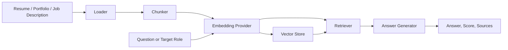

# Resume RAG Command Center

A production-style RAG project for resume intelligence, role matching, and interview preparation. It combines a FastAPI backend, a polished Streamlit dashboard, document ingestion, vector retrieval, grounded answers, and role-fit analysis into one portfolio-ready system.

The project is designed to demonstrate real LLM infrastructure skills: clean API boundaries, retrieval quality, source-grounded generation, testability, local-first development, and an upgrade path to hosted embeddings or managed vector databases.

## Highlights

- FastAPI service with typed Pydantic schemas.
- Streamlit command-center dashboard for upload, retrieval, role matching, and skill planning.
- PDF, Markdown, and text ingestion.
- Configurable chunking with overlap.
- Persistent local vector store for offline demos and CI.
- Deterministic local embeddings by default.
- Optional OpenAI embeddings and chat generation through environment variables.
- Grounded answers with source snippets and similarity scores.
- Resume-to-job matching with score, strengths, gaps, and evidence.
- Retrieval evaluation utility, Docker assets, CI workflow, and automated tests.

## Architecture



## Quick Start

```powershell
python -m venv .venv
.\.venv\Scripts\Activate.ps1
python -m pip install -e ".[dev]"
copy .env.example .env
```

Run the dashboard:

```powershell
streamlit run streamlit_app.py
```

Open [http://127.0.0.1:8501](http://127.0.0.1:8501), upload a resume or portfolio file, then use the Q&A and role-match tabs.

Run the API:

```powershell
uvicorn resume_rag.api:app --reload
```

Open [http://127.0.0.1:8000/docs](http://127.0.0.1:8000/docs).

## CLI

Index your own files:

```powershell
resume-rag ingest path\to\resume.pdf --type resume
resume-rag ingest path\to\portfolio.md --type portfolio
resume-rag ingest path\to\job-description.txt --type job
```

Ask a grounded question:

```powershell
resume-rag query "What evidence proves this candidate can build RAG systems?"
```

Score a role:

```powershell
resume-rag match "AI Engineering Intern" path\to\job-description.txt
```

## API Examples

Ingest text:

```powershell
Invoke-RestMethod `
  -Method Post `
  -Uri http://127.0.0.1:8000/documents `
  -ContentType "application/json" `
  -Body '{
    "source": "resume.pdf",
    "doc_type": "resume",
    "text": "Built a FastAPI RAG pipeline with embeddings, retrieval, and cited answers."
  }'
```

Ask a question:

```powershell
Invoke-RestMethod `
  -Method Post `
  -Uri http://127.0.0.1:8000/query `
  -ContentType "application/json" `
  -Body '{"question": "What RAG evidence is in this resume?", "top_k": 4}'
```

Match a role:

```powershell
Invoke-RestMethod `
  -Method Post `
  -Uri http://127.0.0.1:8000/match `
  -ContentType "application/json" `
  -Body '{
    "role_title": "AI Engineering Intern",
    "job_description": "Python, FastAPI, RAG, embeddings, semantic search, Docker, testing."
  }'
```

## OpenAI Mode

The project runs locally by default. To use OpenAI-backed embeddings and generation:

```powershell
$env:RESUME_RAG_EMBEDDING_PROVIDER="openai"
$env:RESUME_RAG_LLM_PROVIDER="openai"
$env:RESUME_RAG_OPENAI_API_KEY="sk-..."
```

Re-ingest documents after changing embedding providers so stored vectors use the correct dimensions.

## Quality Checks

```powershell
ruff check src tests streamlit_app.py
pytest
python scripts/demo.py
```

## Resume Bullets

- Built a production-style RAG platform with FastAPI, Streamlit, typed schemas, document ingestion, chunking, vector retrieval, grounded generation, and cited evidence.
- Implemented resume-to-job matching that scores role fit, extracts evidence-backed strengths, and surfaces keyword gaps for ATS and recruiter screens.
- Added deterministic local embeddings for offline demos plus optional OpenAI integration, Docker support, CI, CLI workflows, retrieval evaluation, and automated tests.

## Upgrade Path

- Replace the JSON vector store with FAISS, Pinecone, Weaviate, or Postgres pgvector.
- Add OpenTelemetry spans for ingestion, embedding, retrieval, generation, and dashboard actions.
- Add a job-board ingestion pipeline and outreach-template generator.
- Add auth and per-user indexes for a hosted multi-user version.
